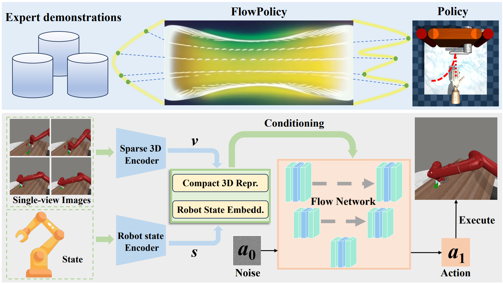

# [AAAI 2025 Oral] FlowPolicy: Enabling Fast and Robust 3D Flow-based Policy via Consistency Flow Matching for Robot Manipulation

<h4 align = "center">Qinglun Zhang<sup>1,2 *</sup>, Zhen Liu<sup>1,2 *</sup>, Haoqiang Fan<sup>2</sup>, Guanghui Liu<sup>1</sup>, Bing Zeng<sup>1</sup>, Shuaicheng Liu<sup>1,2</sup></h4>

<h4 align = "center"> <sup>1</sup>University of Electronic Science and Technology of China</center></h4>
<h4 align = "center"> <sup>2</sup>Megvii Technology</center></h4>

This is the official implementation of our AAAI2025 paper: FlowPolicy: Enabling Fast and Robust 3D Flow-based Policy via Consistency Flow Matching for Robot Manipulation. [Paper](https://arxiv.org/abs/2412.04987)

## News
* **2025.1.18** Our paper has been selected for **oral presentation** at AAAI 2025.
* **2024.12.17** The final version of our paper is now available on [arXiv](https://arxiv.org/abs/2412.04987).
* **2024.12.10** Our paper has been accepted by AAAI 2025.

## Abstract

Robots can acquire complex manipulation skills by learning policies from expert demonstrations, which is often known as vision-based imitation learning. Generating policies based on diffusion and flow matching models has been shown to be effective, particularly in robotic manipulation tasks. However, recursion-based approaches are inference inefficient in working from noise distributions to policy distributions, posing a challenging trade-off between efficiency and quality. This motivates us to propose FlowPolicy, a novel framework for fast policy generation based on consistency flow matching and 3D vision. Our approach refines the flow dynamics by normalizing the self-consistency of the velocity field, enabling the model to derive task execution policies in a single inference step. Specifically, FlowPolicy conditions on the observed 3D point cloud, where consistency flow matching directly defines straight-line flows from different time states to the same action space, while simultaneously constraining their velocity values, that is, we approximate the trajectories from noise to robot actions by normalizing the self-consistency of the velocity field within the action space, thus improving the inference efficiency. We validate the effectiveness of FlowPolicy in Adroit and Metaworld, demonstrating a 7x increase in inference speed while maintaining competitive average success rates compared to state-of-the-art methods. 

## Pipeline

<div align="center">
  
</div>
The above section is a visualization of FlowPolicy. By defining a straight-line flow the data can flow the fastest from the noise distribution to the action distribution (Adroit: Open the door). The following section shows the details of FlowPolicy. Given a certain number of expert presentations, it is first converted into 3D point clouds. The 3D point clouds and the robot state are then fed into two encoders to obtain the compact 3D visual representation and the robot state embedding, respectively. Finally, a straight-line flow is learned by conditional consistency flow matching to generate high-quality robot actions and perform the corresponding tasks (Metaworld: Assembly) at real-time inference speed.

# 💻 Installation

See [install.md](install.md) for installation instructions. 

# 📚 Data
You could generate demonstrations by yourself using our provided expert policies.  Generated demonstrations are under `$YOUR_REPO_PATH/FlowPolicy/data/`.

# 🛠️ Usage
Scripts for generating demonstrations, training, and evaluation are all provided in the `scripts/` folder. 

The results are logged by `wandb`, so you need to `wandb login` first to see the results and videos.

1. Generate demonstrations by `gen_demonstration_adroit.sh` and `gen_demonstration_metaworld.sh`. See the scripts for details. For example:
    ```bash
    bash scripts/gen_demonstration_adroit.sh hammer
    ```
    This will generate demonstrations for the `hammer` task in Adroit environment. The data will be saved in `FlowPolicy/data/` folder automatically.

2. Train and evaluate a policy with behavior cloning. For example:
    ```bash
    bash scripts/train_policy.sh flowpolicy adroit_hammer 0129 0 0
    ```
    This will train a flowpolicy policy on the `hammer` task in Adroit environment using point cloud modality. By default we **save** the ckpt (optional in the script).

3. Evaluate a saved policy or use it for inference. Please set  For example:
    ```bash
    bash scripts/eval_policy.sh flowpolicy adroit_hammer 0129 0 0
    ```
    This will evaluate the saved flowpolicy policy you just trained. **Note: the evaluation script is only provided for deployment/inference. For benchmarking, please use the results logged in wandb during training.**


# 🏷️ License
This repository is released under the MIT license.

# 🙏 Acknowledgement

Our code is built upon [3D Diffusion Policy](https://github.com/YanjieZe/3D-Diffusion-Policy), [Consistency_FM](https://github.com/YangLing0818/consistency_flow_matching),  [VRL3](https://github.com/microsoft/VRL3), and [Metaworld](https://github.com/Farama-Foundation/Metaworld). We would like to thank the authors for their excellent works.

# 🥰 Citation
If you find this repository helpful, please consider citing:

```
@article{zhang2024flowpolicy,
      title={FlowPolicy: Enabling Fast and Robust 3D Flow-based Policy via Consistency Flow Matching for Robot Manipulation}, 
      author={Qinglun Zhang and Zhen Liu and Haoqiang Fan and Guanghui Liu and Bing Zeng and Shuaicheng Liu},
      year={2024}
      eprint={2412.04987},
      archivePrefix={arXiv},
      primaryClass={cs.RO},
      url={https://arxiv.org/abs/2412.04987
}
```
# 🥰 Contact
If you have any questions, feel free to contact Qinglun Zhang at [zhangqinglun@std.uestc.edu.cn](mailto:zhangqinglun@std.uestc.edu.cn).


